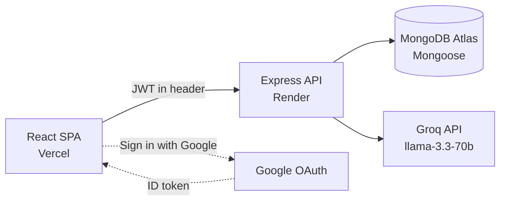

# NipunAI — AI Interview Coach

> **Nipun (निपुण) = "skilled / expert."** Paste a job description, and an LLM generates 8 role-specific interview questions. Answer each one against a live timer, get scored 0–100 with written feedback, and track your progress on an analytics dashboard.

A full-stack **MERN** application with self-built **JWT + bcrypt** authentication, **Google OAuth**, and AI powered by **Groq (llama-3.3-70b)** — deployed 100% free on Vercel, Render, and MongoDB Atlas.

**🔗 Live app:** https://nipun-ai-beta.vercel.app

**🔗 API:** https://nipunai.onrender.com/health

**📦 Repo:** https://github.com/Muditgolaa/NipunAI

> ⚠️ The API is hosted on Render's free tier, which spins down after ~15 min of inactivity — the **first request may take 30–60s** to wake up, then it's fast.

---

## ✨ Features

- **JD → tailored questions** — paste any job description; an LLM generates exactly 8 questions (3 technical, 2 behavioral, 2 system design, 1 situational).
- **Timed interview** — answer one question at a time with a running timer; time spent is recorded per answer.
- **AI scoring** — each answer is scored 0–100 against a rubric (correctness, clarity, examples) with 2–3 sentences of specific, actionable feedback.
- **Session report** — a full per-question breakdown: your answer, its score, feedback, and time taken, with an overall average.
- **Analytics dashboard** — average score, best score, total answered, and completion rate, computed via a MongoDB aggregation pipeline.
- **Two auth methods** — email/password (bcrypt-hashed, self-built JWT) **and** Sign in with Google (OAuth).
- **Neumorphic UI** — a custom, hand-built "soft UI" design system in Tailwind.

---

## 🧱 Tech stack

| Layer | Technology |
|---|---|
| Frontend | React, React Router, Tailwind CSS (v4), Vite |
| Backend | Node.js, Express 5 |
| Database | MongoDB + Mongoose (ODM) |
| Auth | JWT (`jsonwebtoken`) + bcrypt (`bcryptjs`), Google OAuth (`@react-oauth/google` + `google-auth-library`) |
| AI | Groq API — `llama-3.3-70b-versatile` (native `fetch`, no SDK) |
| Security | `express-rate-limit`, CORS, server-side input validation |
| Deployment | Vercel (frontend), Render (backend), MongoDB Atlas (DB) |

Data fetching is a hand-written `useFetch` hook (no TanStack/axios) — deliberately, to demonstrate what a data-fetching library does under the hood.

---

## 🏗️ Architecture



**One session, end to end:**
1. User signs up / logs in (or Google) → receives a **JWT**.
2. Submits a job description → `POST /api/sessions` → session created (`status: pending`).
3. `POST /api/sessions/:id/generate` → Groq returns 8 questions (~2–3s) → `status: ready`.
4. User answers each question → `POST /api/questions/:qid/answers` → Groq scores it → saved.
5. On the 8th answer → `status: completed`.
6. `GET /api/sessions/:id/report` → full graded breakdown.
7. `GET /api/analytics` → aggregate stats for the dashboard.

**Session state machine:** `pending → generating → ready → in_progress → completed`

---

## 🗄️ Data model (4 collections)

- **users** — `name, email (unique), passwordHash (optional), googleId (optional), timestamps`
- **sessions** — `userId (ref), jobTitle, company, jobDescription, status, questionCount, completedAt`
- **questions** — `sessionId (ref), content, category, difficulty, order`
- **answers** — `questionId (ref), sessionId (ref), userId (ref), content, score, feedback, timeSpentSeconds`

**Design decision — reference, not embed:** questions and answers live in their own collections rather than being embedded in the session document, because analytics queries answers *independently* (e.g. average score across all sessions). Rule of thumb: *embed when the child is only read with its parent; reference when it's queried on its own.*

---

## 🔐 Authentication

Two paths, one token model:

- **Email / password:** `bcrypt.hash(password, 10)` on register (plaintext is never stored); `bcrypt.compare` on login; then a **JWT** is signed (`{ userId }`, 7-day expiry).
- **Google OAuth:** the frontend gets a Google ID token; the backend **verifies its signature and audience** with `google-auth-library`, then find-or-creates the user and issues **its own JWT** — so the rest of the app is identical regardless of how you signed in.

A `requireAuth` middleware verifies the JWT on every protected route and sets `req.userId`; **every database query is scoped to that ID**, so users can only ever access their own data.

---

## 📡 API

```
POST   /api/auth/register        email/password signup
POST   /api/auth/login           email/password login
POST   /api/auth/google          verify Google token → issue JWT
GET    /api/auth/me              current user            [auth]

POST   /api/sessions             create a session        [auth]
GET    /api/sessions             list my sessions        [auth]
GET    /api/sessions/:id         one session             [auth]
POST   /api/sessions/:id/generate  Groq generates 8 Qs   [auth, rate-limited]
GET    /api/sessions/:id/questions                       [auth]
GET    /api/sessions/:id/report                          [auth]
DELETE /api/sessions/:id                                 [auth]

POST   /api/questions/:qid/answers  submit + Groq scores  [auth, rate-limited]

GET    /api/analytics            aggregate stats         [auth]
```

---

## 🚀 Run it locally

**Prerequisites:** Node 18+, a MongoDB Atlas URI, a Groq API key, and (optional) a Google OAuth Client ID.

```bash
git clone https://github.com/Muditgolaa/NipunAI.git
cd NipunAI
```

**Backend**
```bash
cd backend
npm install
# create backend/.env (see below)
npm run dev        # http://localhost:5001
```
`backend/.env`:
```
PORT=5001
MONGODB_URI=your_atlas_connection_string
JWT_SECRET=any_long_random_string
GROQ_API_KEY=your_groq_key
CLIENT_URL=http://localhost:5173
GOOGLE_CLIENT_ID=your_google_client_id
```

**Frontend**
```bash
cd frontend
npm install
# create frontend/.env (see below)
npm run dev        # http://localhost:5173
```
`frontend/.env`:
```
VITE_API_URL=http://localhost:5001
VITE_GOOGLE_CLIENT_ID=your_google_client_id
```

---

## 🧠 Key engineering decisions

- **Self-built auth over a managed service** — to understand the full flow: hashing, token signing, and middleware verification, rather than treating it as a black box.
- **Synchronous AI over a job queue** — Groq responds in under 2s, so a queue would be premature complexity; I know the exact threshold (job takes minutes) where I'd switch.
- **Aggregation pipeline for analytics** — average/best/completion computed in the database in one round trip, not by pulling every document into Node.
- **Rate limiting on AI routes** — protects the Groq free tier from being drained.
- **Fail-fast config** — the server refuses to start (and crashes loudly, so it restarts) if a critical env var or the database is unreachable, instead of silently serving broken requests.

## 🔭 What I'd do differently at scale

- Move AI evaluation to a **background job queue** so the answer endpoint doesn't block under load.
- Swap in-memory rate limiting for a **Redis-backed** store (survives restarts, works across instances).
- Move the JWT from `localStorage` to an **httpOnly cookie** to reduce XSS risk (with CSRF handling).
- Horizontal-scale the stateless API behind a load balancer; serve analytics reads from MongoDB **replica secondaries**.

---

## 📄 License

MIT — built by [Mudit Gola](https://github.com/Muditgolaa) as a portfolio project.
